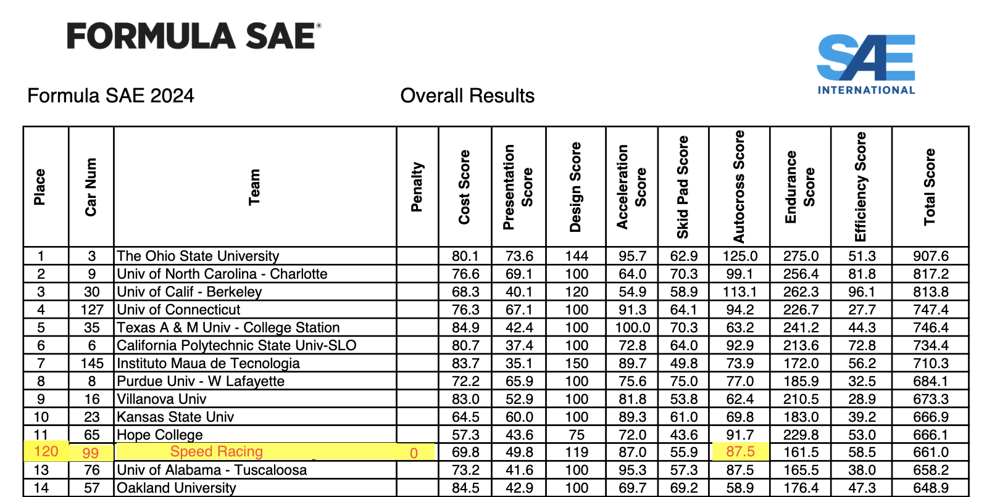

# Pull Requests Guidelines

### Hey, im from "insert team name" and you have made a mistake on our data! 

- First of all, apologies, I tried my best to go over my extracted data, so since I made a mistake, help me fix it by:

Opening a pull request with the following content:
> [!IMPORTANT]
> Familiarize yourself with the template of the competition year affected, as it holds the schema of the data, you will need to reference it when requesting a fixed entry.

## For branch name:
[action]-[context]

action:
  * update
  * delete
  * change
  * add
context:
  * database
  * internal_files
  * license 


### PR Template:
* Team of requester name: [optional]
* Name of requester : [optional]
* University email : [optional]
* Should include:
  * Competition year/s affected:
    * FSAE [location] - [class] [year]
  * Event/s affected
    * FSAE [location] - [class] [year]:
      * [event]
* For every event affected you would include:
  * Event name
  * Template/s reference:
    * FSAE_Year.json 
  * Column/s affected
  * Current erroneous data
    * Enter in JSON format all entries or sections of the dataset.
  * Corrected data
    * Enter in JSON format all entries or sections of the dataset.
  * Source Truth Reference:
    * Screenshot of the PDF that you are indicating the corrected data.


### Example PR:
* Team of requester name: Speed Racing
* Name of requester : Speed Mcqueen
* University email : fastandinefficient@speed.edu
* Competition year/s affected:
  1. FSAE Michigan - IC 2024
  2. FSAE Michigan - IC 2023
* Event/s affected
  1. FSAE Michigan - IC 2024:
     1. Overall
  2. FSAE Michigan - IC 2023:
     1. Endurance
     2. Acceleration
   
## FSAE Michigan - IC 2024 - [Overall]:
* Template -> FSAE_2024.json
* Column/s affected:
  * Autocross Score
  * Penalty
### Erroneous data:
```json
 "120": [
            {
                "Place": 120,
                "Car Num": 99,
                "Team": "Speed Racing",
                "Penalty": 10,
                "Cost Score": 73.2,
                "Presentation Score": 41.6,
                "Design Score": 100.0,
                "Acceleration Score": 95.3,
                "Skid Pad Score": 57.3,
                "Autocross Score": 30,
                "Endurance Score": 165.5,
                "Efficiency Score": 38.0,
                "Total Score": 658.2
            }
        ],
```
### Corrected data:
```json
 "120": [
            {
                "Place": 120,
                "Car Num": 99,
                "Team": "Speed Racing",
                "Penalty": 0,
                "Cost Score": 73.2,
                "Presentation Score": 41.6,
                "Design Score": 100.0,
                "Acceleration Score": 95.3,
                "Skid Pad Score": 57.3,
                "Autocross Score": 87.5,
                "Endurance Score": 165.5,
                "Efficiency Score": 38.0,
                "Total Score": 658.2
            }
        ],
```
### Source Truth Reference:

  * Source Truth Reference:
    * Screenshot of the PDF that you are indicating the corrected data.

### ***You would do the same for every event affected, and then you would submit the PR.***
# Thank you in advance for your help!
